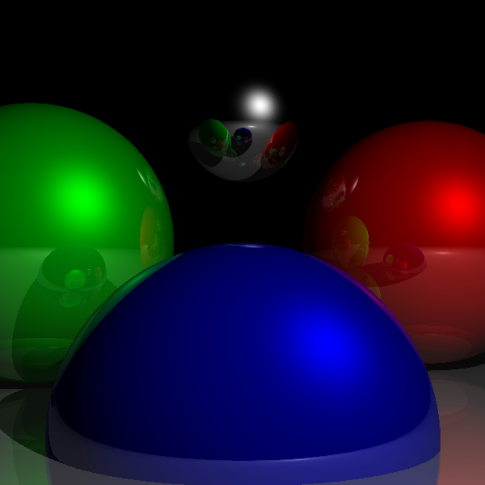

# RayTracer
A simple ray tracing program written in Java.

## Description
This project uses [ray tracing](https://en.wikipedia.org/wiki/Ray_tracing_(graphics)), a graphics technique for rendering three-dimensional scenes, to generate a photorealistic image.

Ray tracing is a technique that simulates light from a light source bouncing off an object and being reflected into a camera. In this project, the camera is represented by the [Camera3D](Camera3D.java) class, and objects in the scene are represented using the [Material3D](Material3D.java) interface.

## Features
Currently, this framework supports a single light source and handles reflection and shadows. Some possible future features could be support for multiple light sources, and some other optical effects such as refraction, scattering, and chromatic aberration.

## Example
An example of a simple scene with five spheres is shown in the [`RayTracingDemo.java`](RayTracingDemo.java) class. The class creates the following simple scene, saved to an image.

